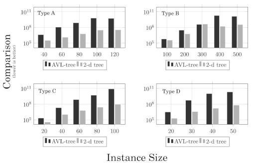
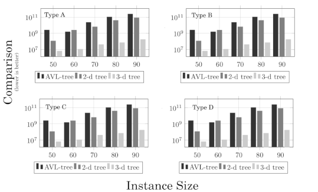

# My PhD Thesis Implementation

Author: Marcos Daniel Baroni

Date: 2018-12-10

Several combinatorial problems involve the simultaneous optimization of multiple criteria, which are generally conflicting with each other.
These problems are called multiobjective and
do not have a single solution, but a set of solutions of interest.
This work proposes the acceleration of the resolution process of the multiobjective knapsack problem,
through the use of a *kdtree* as a multidimensional index structure to assist the manipulation of solutions.

### The thesis: [link](doc/tese/thesis-mbaroni-final.pdf)

### Paper about the approach: [link](doc/paper.pdf)

### Description of folders:
 * **bin**: binaries and scripts
 * **doc**: documentation and publications
 * **exp**: experiments records
 * **insts**: problem instances
 * **mip**: mathematical integer programming descriptions
 * **misc**: miscellaneous related files
 * **script**: more scripts
 * **src**: algorithms source code
   * **metahrs**: metaheuristics implementation
   * **models**: models (structured) of problems
   * **soplex**: soplex example
   * **tools**: tools implementation (main: [mokp.c](src/tools/mokp.c))
   * **utils**: useful data structures implementation

### Results summary
#### 2D Instances

#### 2D Instances

